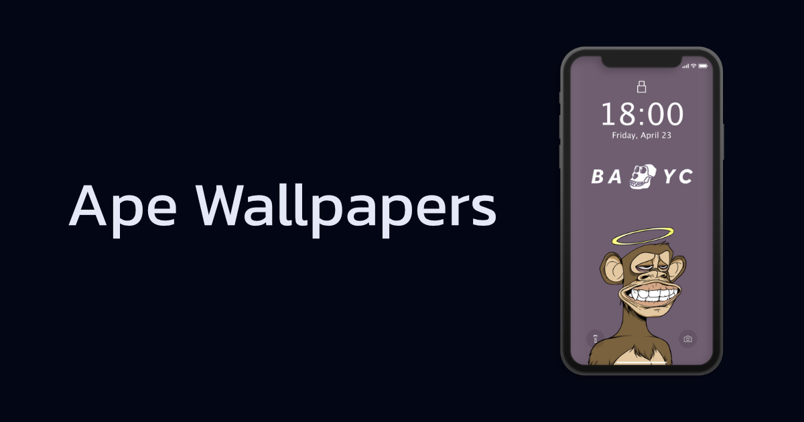

[][1]

## ⭐  About
Over many months of being actively involved in the [Web3 and NFT space][2], as well as being a member of the [Bored Ape Yacht Club (BAYC)][3] community, Ape Wallpapers was created out of a desire to contribute and build something of value for this community. 

In the Ape Wallpapers web app, the process of creating mobile wallpapers of BAYC NFTs is extremely streamlined, allowing ape holders and community members to seamlessly express their Web3 identity on their lock screens.

This is the first project where I was required to dabble into image manipulation. I first had to fetch the image of the ape from IPFS (only available in square dimensions), and then combined it with the logos and custom text of the user's choice to construct the wallpaper.

Visit the website at [apewallpapers.com][1] to check it out!

## 🚀  Reception
At launch, the site was very positively received by the community; reaching a peak user count of over 3000 users, as well as spawning an array of copies and similar websites from other NFT communities. Take a look at all the happy users flexing their wallpapers generated from the site on the dedicated Twitter thread [here][4]!

## 🛠️  Key Technologies
This frontend UI of the project was deployed on AWS and built using:

- React
- Redux
- TypeScript
- Material-UI

The backend server of the project was deployed on Heroku and built using:

- Express

## 😊  Contact Me
If you liked the website or just want to get in touch, email me at <a href="mailto:theleonardtng@gmail.com">theleonardtng@gmail.com</a> or drop me a message at the various social media platforms listed at the bottom of [my website][5]. Cheers.

[1]: https://apewallpapers.com
[2]: https://ethereum.org/en/web3/
[3]: https://boredapeyachtclub.com/
[4]: https://twitter.com/Brainy8469/status/1533502239515414528
[5]: https://leonardtng.com
